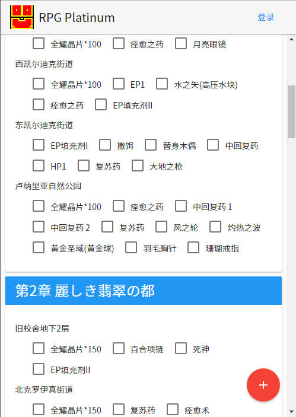

## RPG Platinum

制作和标记RPG游戏中需要完成的目标。

## 预览图

## 设置和安装

在你的数据库创建一个叫做`rpgplatinum`的库。

复制`data/conn_sample.php`为`data/conn.php`并将数据库连接信息改为你的数据库。

(optional)在`data/config.php`中修改需要修改的内容。

使用`/action/install.php`完成初次设置和安装。
